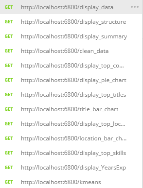
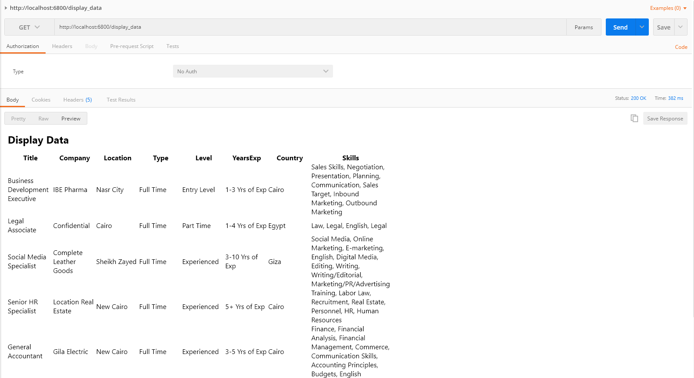
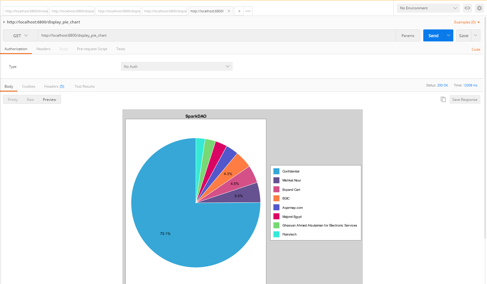

# Importing postman testing collection
Use provided json file: Java.postman_collection.json, and this guide [here](https://learning.postman.com/docs/getting-started/importing-and-exporting-data/)

# Sample images

